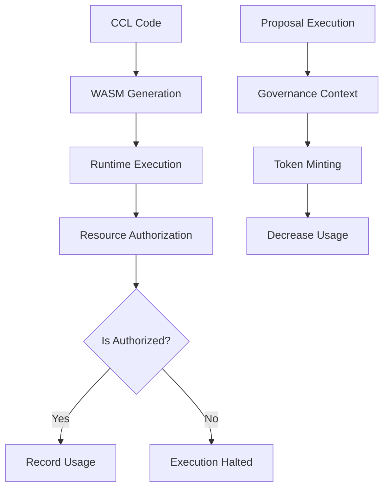

# ICN Economics

The `icn-economics` crate provides resource tracking, authorization, and accounting for the ICN platform.

## Overview

The economics system enables resource metering and policy enforcement for computational resources in WebAssembly execution environments. It tracks resource usage by identity (DID) and enforces authorization policies.

## Core Components

### ResourceType

An enum representing different types of resources that can be tracked:

- **CPU**: Computational resources
- **Memory**: Memory allocation
- **IO**: Input/output operations
- **Token**: General-purpose token resources

### ResourceAuthorizationPolicy

A policy configuration that defines resource limits:

- `max_cpu`: Maximum allowed CPU usage
- `max_memory`: Maximum allowed memory usage
- `token_allowance`: Maximum allowed token usage

### Economics

The main engine that enforces resource limits and tracks usage:

- `authorize(did, resource_type, amount)`: Checks if a DID is authorized to use resources
- `record(did, resource_type, amount, ledger)`: Records resource usage in the ledger
- `mint(did, resource_type, amount, ledger)`: Mints tokens for a DID (reduces usage, governance-only)
- `get_usage(did, resource_type, ledger)`: Retrieves usage for a specific DID and resource
- `get_total_usage(resource_type, ledger)`: Retrieves total usage across all DIDs

### LedgerKey

A composite key for the resource ledger that associates DIDs with resource types:

```rust
pub struct LedgerKey {
    pub did: String,
    pub resource_type: ResourceType,
}
```

## Integration with WASM Runtime

The economics system is integrated with the WASM runtime through host functions:

1. `host_check_resource_authorization`: Checks if a resource usage is authorized
2. `host_record_resource_usage`: Records resource usage in the ledger
3. `host_is_governance_context`: Checks if execution is in a governance context
4. `host_mint_token`: Mints tokens for a DID (only in governance context)

These functions are exposed to WASM modules and can be called from within CCL files.

## Using Resource Functions in CCL

### Resource Metering

To track resource usage in your CCL code:

```ccl
execution {
    perform_metered_action("compute_hash", ResourceType.CPU, 25);
    perform_metered_action("store_data", ResourceType.MEMORY, 50);
    perform_metered_action("publish_result", ResourceType.TOKEN, 10);
}
```

### Token Minting (Governance Only)

Tokens can only be minted from a governance context (like during proposal execution):

```ccl
actions {
  on "proposal.approved" {
    mint_token {
      type "participation_token"
      amount 100
      recipient "did:icn:participant-123"
    }
  }
}
```

## CLI Commands

```bash
# Check token balance for a DID
icn-cli ledger show --did did:icn:user123 --resource TOKEN

# Mint tokens (governance context only)
icn-cli ledger mint --did did:icn:user123 --amount 100

# Execute a WASM file in governance context
icn-cli runtime execute --wasm tokens.wasm --governance
```

## Flow Diagram



## Per-Identity Resource Tracking

Resources are tracked per DID, allowing for:

- Different quotas for different identities
- Resource isolation between cooperatives
- Accountability for resource consumption

## CLI Integration

The economics system integrates with the ICN CLI:

- `icn-cli ledger show --resource Token`: Query the ledger
- `icn-cli coop mint --resource Token --amount 100`: Mint tokens for a cooperative 