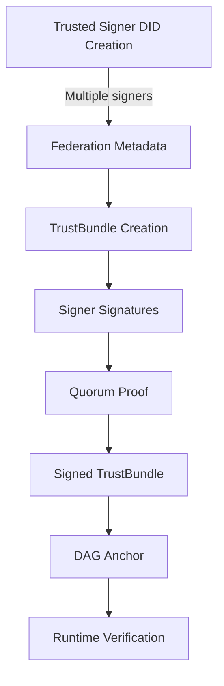

# Identity & Trust in ICN

This documentation outlines the identity and trust primitives in the InterCooperative Network.

## Decentralized Identifiers (DIDs)

DIDs are cryptographically verifiable identifiers that serve as the foundation of identity in ICN.

- ICN uses the `did:key` method with Ed25519 keys
- DIDs are constructed with multicodec/multibase encoding 
- Format: `did:key:z<base58-encoded-public-key>`

```rust
// Creating a DID from a keypair
let kp = KeyPair::generate();
println!("My DID: {}", kp.did.as_str());

// Verifying a signature from a DID
let msg = b"Hello ICN";
let signature = kp.sign(msg);
let did_key = kp.did.to_ed25519().unwrap();
did_key.verify(msg, &signature);
```

## Verifiable Credentials (VCs)

VCs provide a mechanism for issuing claims that others can cryptographically verify.

- Generic `VerifiableCredential<T>` can wrap any serializable data
- Canonical serialization ensures deterministic signatures
- Verification uses embedded proof or direct signature verification

```rust
// Create a credential with custom data
let vc = VerifiableCredential {
    context: vec!["https://www.w3.org/2018/credentials/v1".into()],
    types: vec!["VerifiableCredential".into()],
    issuer: kp.did.clone(),
    issuance_date: chrono::Utc::now(),
    credential_subject: YourDataType { ... },
    proof: None,
};

// Sign the credential
let signed = vc.sign(&kp).unwrap();

// Verify the credential
signed.verify(&kp.pk).unwrap();
```

## Quorum Proofs & Trust Bundles

Trust Bundles establish federation-wide trust roots through quorum signatures.

### Quorum Proofs

Quorum proofs collect signatures from multiple authorized signers and validate them against a quorum policy:

- **Majority Quorum**: Requires >50% of allowed signers
- **Threshold Quorum**: Requires a specific number of signers
- **Weighted Quorum**: Assigns different voting weights to signers

```rust
// Create a quorum proof requiring majority approval
let proof = QuorumProof::new(QuorumType::Majority, signatures);

// Verify against message and allowed signers
proof.verify(message, &allowed_signers)?;
```

### Trust Bundles

A TrustBundle combines:
1. A root DAG CID (Content Identifier)
2. Federation metadata
3. A quorum proof validating the bundle

```rust
// Create and verify a trust bundle
let bundle = TrustBundle::new(root_cid, federation_metadata);
let hash = bundle.calculate_hash()?;

// Add a quorum proof (signatures from trusted signers)
bundle.add_quorum_proof(quorum_proof);

// Verify the bundle
bundle.verify(&trusted_keys)?;
```

## Benchmarks

Performance benchmarks (AMD EPYC 7763 VM):
- VC verification: ~42 µs
- TrustBundle verification: ~118 µs

## Trust Chain



This establishes a cryptographically verifiable chain of trust from independent trusted signers through quorum signatures to the federation's root of trust. 