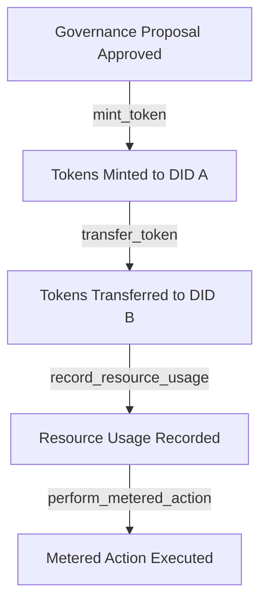

# Token Minting in ICN

The ICN platform includes a robust resource economics system that tracks and manages various types of resources, including tokens. This document describes how tokens can be minted and managed within the ICN ecosystem.

## Overview

Tokens in ICN represent a valuable resource that can be used for various purposes:

- Rewarding participation in governance
- Allocating resources for computational tasks
- Tracking contributions to cooperative initiatives
- Managing rights and privileges within a federation
- Facilitating economic exchange between participants

Token minting is a privileged operation that can only be performed in a governance context, such as during the execution of an approved proposal. Token transfers, on the other hand, can be performed by any participant with sufficient token balance.

## Architecture

The token system consists of the following components:

### 1. Economics Engine

The core component that tracks resource usage and enforces limits:

```rust
pub struct Economics {
    policy: ResourceAuthorizationPolicy,
}
```

### 2. Resource Ledger

A shared ledger that tracks resource usage by identity (DID):

```rust
// Maps (DID, ResourceType) to amount
pub type ResourceLedger = HashMap<LedgerKey, u64>;

pub struct LedgerKey {
    pub did: String,
    pub resource_type: ResourceType,
}
```

### 3. Host Functions

WebAssembly host functions that expose economic operations:

```rust
// Check if in governance context (0=no, 1=yes)
pub fn host_is_governance_context() -> i32;

// Mint tokens (governance-only)
pub fn host_mint_token(recipient_ptr: i32, recipient_len: i32, amount: u64) -> i32;

// Transfer tokens (any context, requires sufficient balance)
pub fn host_transfer_token(sender_ptr: i32, sender_len: i32, recipient_ptr: i32, recipient_len: i32, amount: u64) -> i32;
```

## Token Operations

### Minting Tokens

Token minting can be expressed in CCL using the `mint_token` block:

```ccl
actions {
  on "proposal.approved" {
    mint_token {
      type "governance_token"
      amount 100
      recipient "did:icn:participant123"
    }
  }
}
```

The CCL compiler generates WASM code that:

1. Checks if execution is in a governance context
2. If yes, calls the token minting host function
3. Passes the recipient DID and amount

### Transferring Tokens

Token transfers can be performed by any participant with sufficient tokens:

```ccl
actions {
  on "transaction.started" {
    transfer_token {
      type "governance_token"
      amount 40
      sender "did:icn:alice"
      recipient "did:icn:bob"
    }
  }
}
```

The CCL compiler generates WASM code that:

1. Calls the token transfer host function
2. Passes the sender DID, recipient DID, and amount
3. The operation succeeds only if the sender has sufficient balance

## Token Accounting

Tokens are accounted for in the resource ledger. When tokens are minted for a DID, it reduces their token usage in the ledger. When tokens are transferred, the sender's usage increases and the recipient's usage decreases.

```rust
// Minting tokens
pub fn mint(&self, recipient: &Did, rt: ResourceType, amt: u64, ledger: &RwLock<HashMap<LedgerKey, u64>>) -> i32 {
    // Get the current usage and subtract the amount (minting reduces usage)
    let current = l.entry(key.clone()).or_insert(0);
    if *current < amt {
        *current = 0;
    } else {
        *current -= amt;
    }
    0 // Success
}

// Transferring tokens
pub fn transfer(&self, sender: &Did, recipient: &Did, rt: ResourceType, amt: u64, ledger: &RwLock<HashMap<LedgerKey, u64>>) -> i32 {
    // Check if sender has sufficient balance
    let sender_usage = *l.get(&sender_key).unwrap_or(&0);
    if sender_usage < amt {
        return -1; // Insufficient funds
    }
    
    // Increase sender's usage (decreasing their token balance)
    l.insert(sender_key, sender_usage + amt);
    
    // Decrease recipient's usage (increasing their token balance)
    let recipient_usage = *l.get(&recipient_key).unwrap_or(&0);
    let new_recipient_usage = if recipient_usage < amt { 0 } else { recipient_usage - amt };
    l.insert(recipient_key, new_recipient_usage);
    
    0 // Success
}
```

## CLI Usage

The ICN CLI provides commands for working with tokens:

```bash
# Check token balance for a DID
icn-cli ledger show --did did:icn:user123 --resource TOKEN

# Mint tokens (governance context only)
icn-cli ledger mint --did did:icn:user123 --amount 100

# Transfer tokens between DIDs
icn-cli token transfer --from did:icn:alice --to did:icn:bob --amount 40

# Execute a WASM file in governance context
icn-cli runtime execute --wasm tokens.wasm --governance
```

## Token Flow

Here's a diagram of the token flow in the system:



## Security Considerations

- Token minting is restricted to governance contexts
- Proposals that mint tokens require approval through the governance process
- Token transfers require sufficient balance from the sender
- All token operations are recorded in the ledger for auditability

## Future Enhancements

- Time-limited token grants
- Specialized token types for different purposes
- Token staking mechanisms
- Advanced economic primitives (escrow, trustless exchange, etc.)

## Conclusion

The ICN token system provides a secure, accountable way to manage valuable resources within the cooperative platform. By combining privileged minting with permissionless transfers, it creates a foundation for economic activity while maintaining the integrity of token supply. 